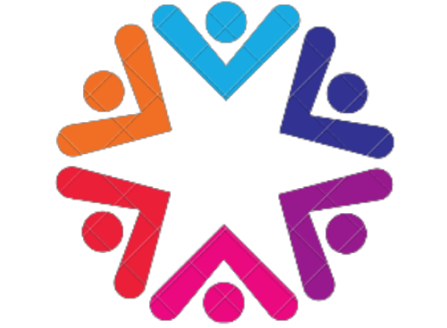

# 🌿 AROGYAM

<p align="center">
  
</p>

<h3 align="center">
A Modern Mental Wellness & Therapy Platform
</h3>

<p align="center">
Empowering mental well-being through positivity, therapy resources, mindfulness, and emotional support.
</p>

---

# 📖 About AROGYAM

AROGYAM is a modern mental wellness and therapy platform designed to help users improve their emotional and psychological well-being through multiple therapeutic approaches and wellness activities.

The platform provides an interactive and user-friendly experience where users can explore various therapies, mindfulness practices, motivational content, relaxation techniques, and wellness resources in a beautifully designed environment.

AROGYAM aims to create awareness about mental health and encourage people to prioritize emotional wellness in their daily lives.

---

# ✨ Features

- 🧘 Yoga Therapy
- 📚 Reading Therapy
- 🎵 Audio Therapy
- 😊 Laugh Therapy
- 💬 Talking Therapy
- 🌸 Spiritual Therapy
- 👶 Child Therapy
- 🎯 Motivational Content
- 📱 Responsive Design
- ⚡ Smooth UI & Interactive Experience
- 🌐 Fully Frontend-Based Website

---

# 🛠️ Technologies Used

- HTML5
- CSS3
- JavaScript
- Node.js (Optional Backend)
- Express.js
- MongoDB (Optional)

---

# 📂 Project Structure

```bash
AROGYAM/
│
├── backend/
├── css/
├── docs/
├── html/
├── images/
├── js/
├── index.html
├── style.css
└── README.md